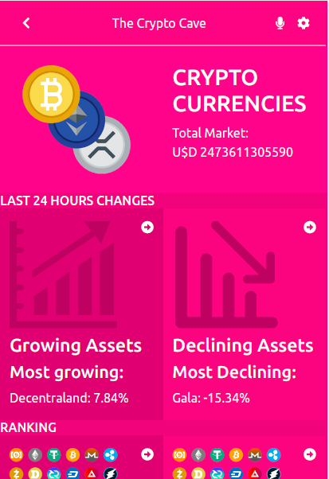

# The Crypto Cave 

A website that displays some data about the most important cryptocurrencies in real-time. The data is consumed from the API https://docs.coincap.io/. The currencies can be filtered by the price change in the last 24 hours or by position in the ranking. The design was based on [this template](https://www.behance.net/gallery/31579789/Ballhead-App-(Free-PSDs)).

## Live Demo

[The Crypto Cave](https://thecryptocave.netlify.app/)

## Explanatory Video

[Here](https://www.loom.com/share/44149658d99144b7ae7f65e7f662a4c8)

## Built With

- React
- Redux
- Bootstrap 
- Javascript
- CSS
- JSX

## Getting Started

- Clone this repository;
- Open the cloned folder on the IDE of your choice;
- Install dependencies with `npm i`;
- Use `npm start` to start the website;
- 
## Author

👤 **Nacho Sala**

- GitHub: [@nachosala89](https://github.com/nachosala89)
- Twitter: [@nachosala89](https://twitter.com/nachosala89)
- LinkedIn: [Juan Ignacio Sala](https://www.linkedin.com/in/nacho-sala)

## 🤝 Contributing

Contributions, issues, and feature requests are welcome!

Feel free to check the [issues page](../../issues/).

## Show your support

Give a ⭐️ if you like this project!

## Acknowledgments

- The creator of the original design [Nelson Sakwa](https://www.behance.net/sakwadesignstudio).
- Microverse

## 📝 License

This project is [MIT](./MIT.md) licensed.

